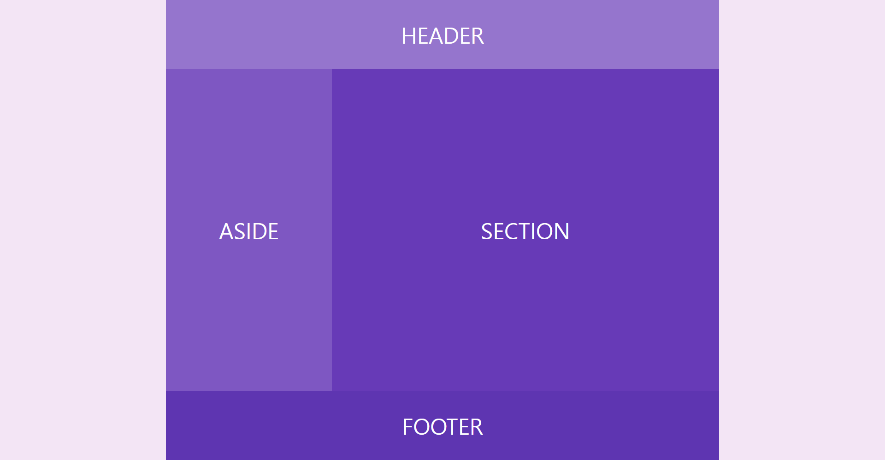

# Responsive Layout 1

[This video](https://wtss.tistory.com/206) taught me.

## Demo

- [float](https://focused-hawking-d09d86.netlify.app/responsive-1/float/)
- [flex](https://focused-hawking-d09d86.netlify.app/responsive-1/flex/)

## Screenshots

