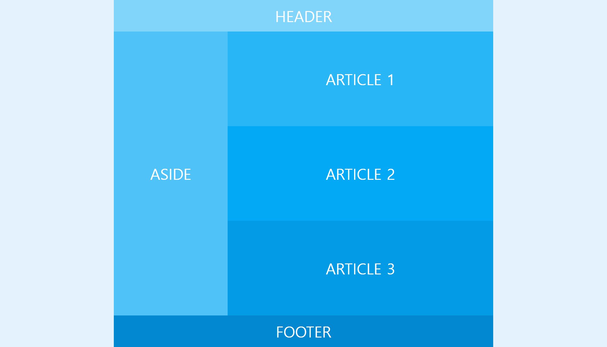
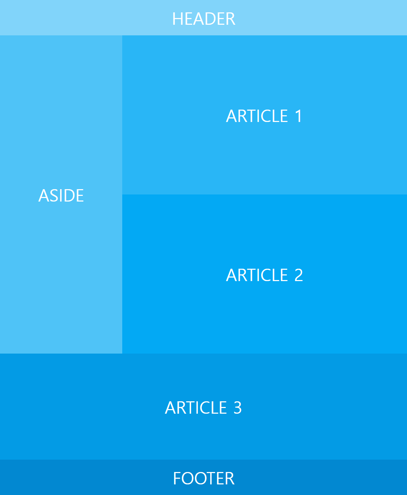
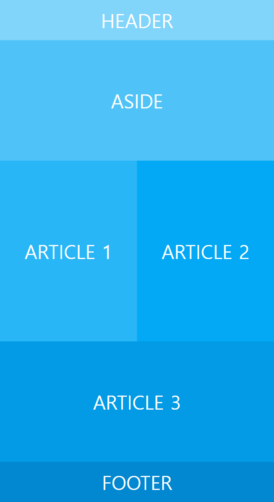
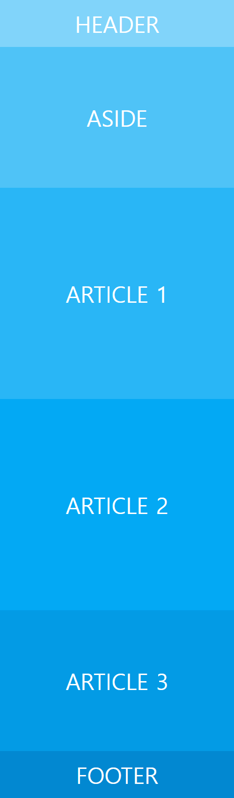

# Responsive Layout 3

[This video](https://wtss.tistory.com/208) taught me how to make a responsive layout using float.  
Furthermore, made it using flex.

## DEMO
- [float](https://focused-hawking-d09d86.netlify.app/responsive-3/float/)
- [flex](https://focused-hawking-d09d86.netlify.app/responsive-3/flex/)

## Screenshots

