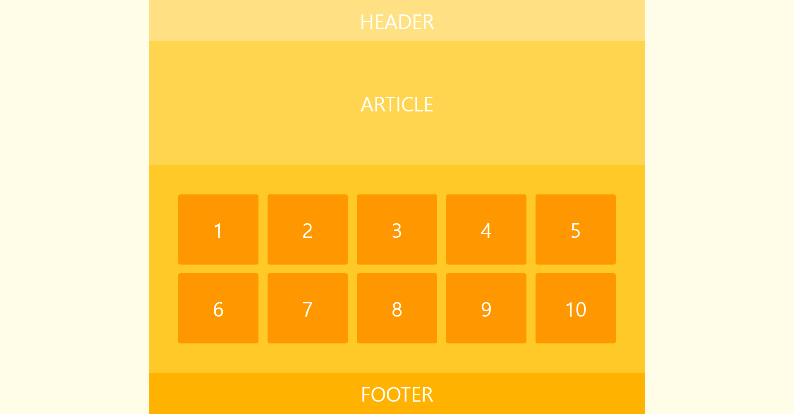
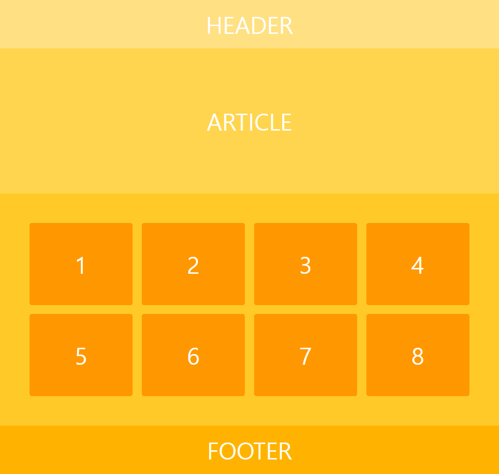
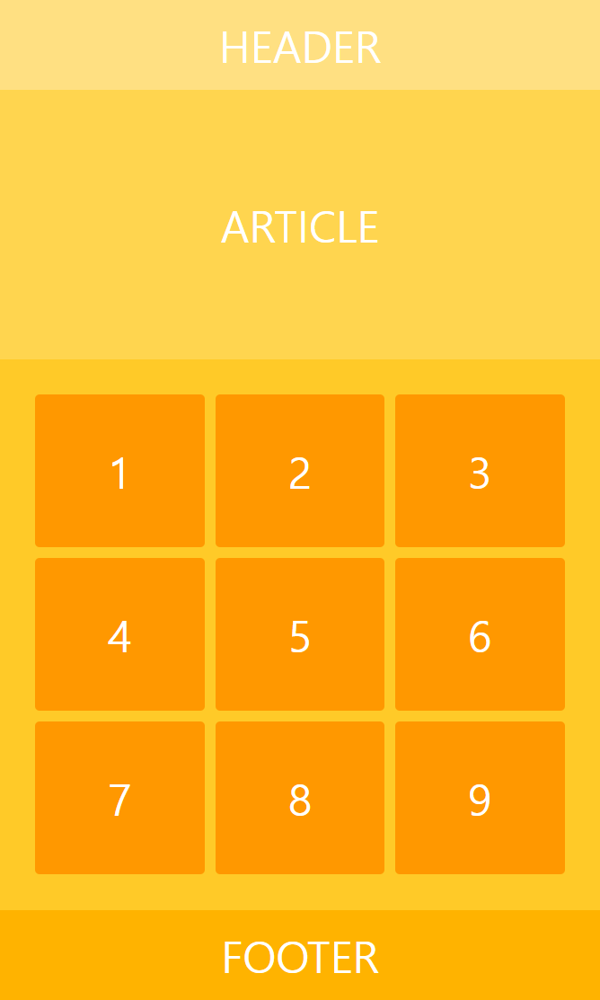
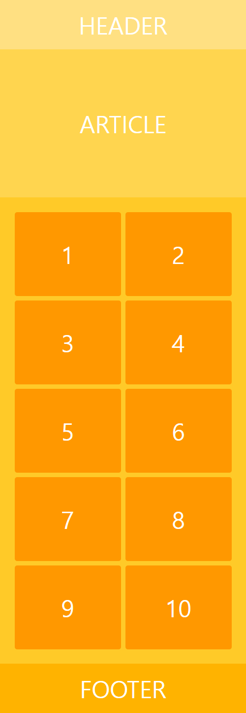

# Responsive Layout 4

[This video](https://wtss.tistory.com/209) taught me.

## Demo

- [float](https://focused-hawking-d09d86.netlify.app/responsive-4/float/)
- [flex](https://focused-hawking-d09d86.netlify.app/responsive-4/flex/)
- [grid](https://focused-hawking-d09d86.netlify.app/responsive-4/grid/)

## Screenshots

