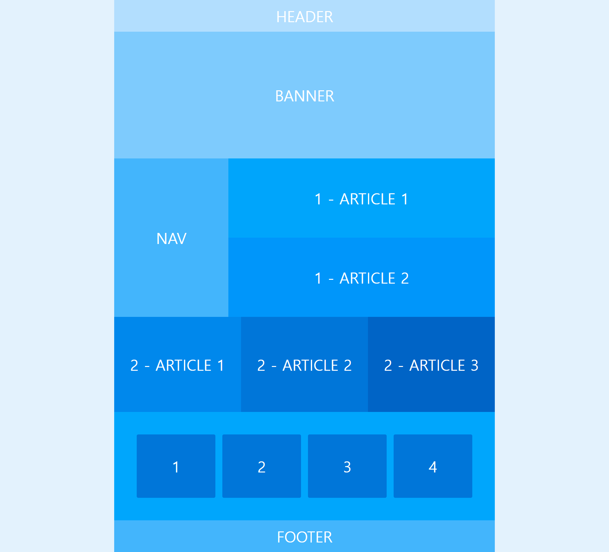
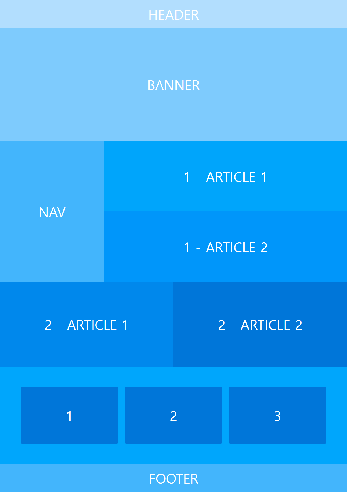
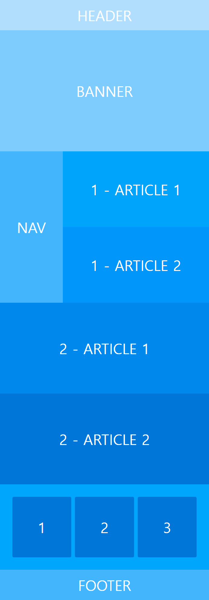
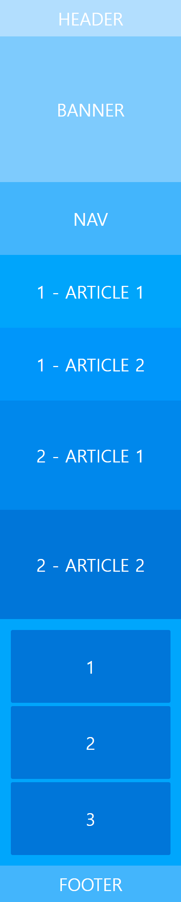

# Responsive Layout 5

[This video](https://wtss.tistory.com/210) taught me how to make a responsive layout using float.  
Furthermore, made it using flex.

## DEMO
- [float]()
- [flex]()

## Screenshots

